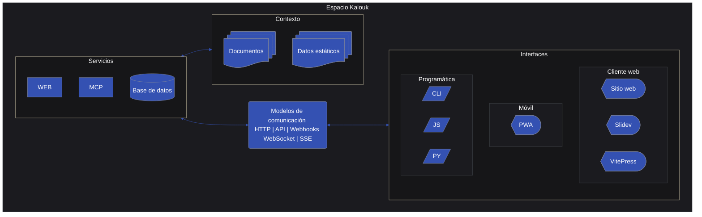

# Proyecto

---

## Modelos Probabilísticos de Señales y Sistemas

- Curso introductorio de probabilidad y estadística
- Pura programación
- Puro sabor

```mermaid
%%{
  init: {
    'theme': 'base',
    'themeVariables': {
      'darkMode': true,
      'fontSize': '18px',
      'primaryColor': '#3451b2',
      'primaryTextColor': '#fff',
      'lineColor': '#3451b2',
      'tertiaryTextColor': '#fff'
    }
  }
}%%
flowchart TD
    subgraph K [Espacio Kalouk]
        subgraph S [Servicios]
            WEB@{ shape: process, label: "WEB"}
            MCP@{ shape: process, label: "MCP"}
            DB@{ shape: database, label: "Base de datos"}
        end
        COM@{ shape: event, label: "Modelos de comunicación \n HTTP | API | Webhooks \n WebSocket | SSE"}
        subgraph I [Interfaces]
            subgraph W [Cliente web]
                SITE@{ shape: display, label: "Sitio web"}
                SLI@{ shape: display, label: "Slidev"}
                VP@{ shape: display, label: "VitePress"}
            end
            subgraph M [Móvil]
                PWA@{ shape: display, label: "PWA"}
            end
            subgraph P [Programática]
                CLI@{ shape: in-out, label: "CLI"}
                JS@{ shape: in-out, label: "JS"}
                PY@{ shape: in-out, label: "PY"}
            end
        end
        subgraph C [Contexto]
            DOCS@{ shape: docs, label: "Documentos"}
            DATA@{ shape: docs, label: "Datos estáticos"}
        end
    end

    S <--> COM
    COM <--> I
    S <--> C

    classDef base fill:#1b1b1f,stroke:#3c3f44,stroke-width:1px
    classDef surface fill:#161618
    class K base
    class S surface
    class I surface
    class C surface
    class P base
    class M base
    class W base
```
