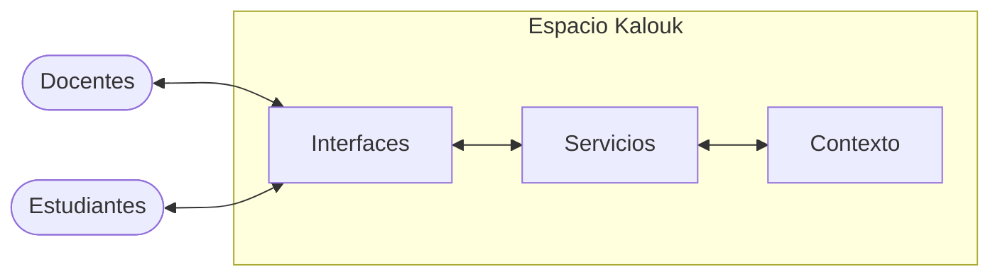
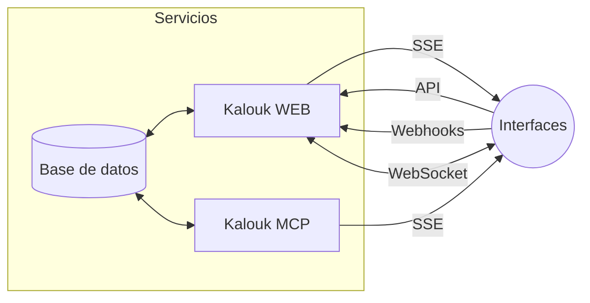
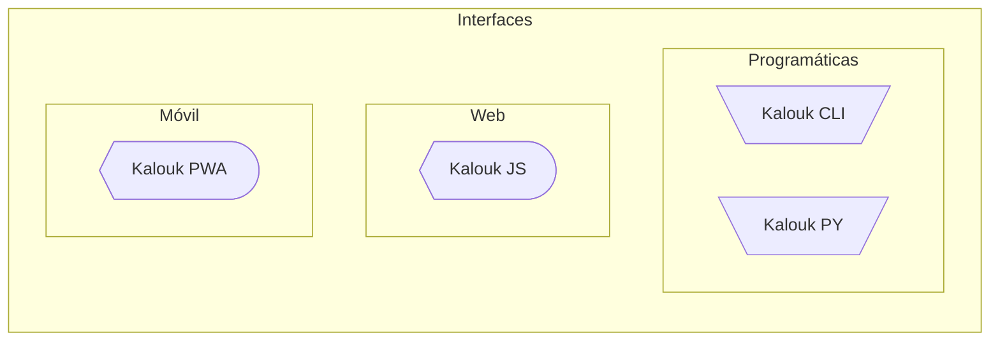
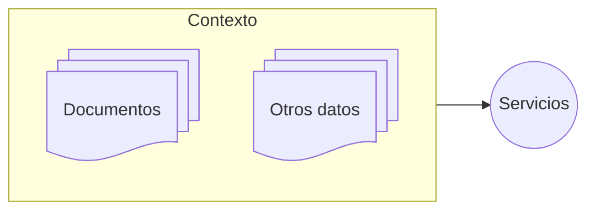

# Kalouk

## Componentes web para matemáticas y programación

---

#### Proyecto de Docencia PD-IE-472-2022

## Estrategias docentes para sesiones virtuales interactivas con el desarrollo de un nuevo sistema web: una experiencia en el curso Modelos Probabilísticos de Señales y Sistemas

**Fabián Abarca Calderón** <br> 
*Escuela de Ingeniería Eléctrica* <br>
*Universidad de Costa Rica*

---
layout: fact
---


# Kalouk

Un <span v-mark.red="1">ecosistema</span> de herramientas computacionales y componentes web para la creación de <span v-mark.circle.orange="2">contenidos interactivos</span> con matemáticas y programación para <span v-mark.green="3">análisis de datos</span>.

---
layout: grid
---

# Componentes

::A::
Kalouk **WEB**

::B::
Kalouk **MCP**

::C::
Kalouk **CLI**

::D::
Kalouk **JS** 

::E::
Kalouk **PY**

::F::
Kalouk **XYZ** 

::G::
Kalouk **PWA**

::H::
**improbabilidades**.com

::I::
Kalouk **PyX**

---
layout: fact
---

# Estrategia de aplicación

La base para crear experiencias educativas interactivas con las herramientas desarrolladas es la creación de un <span v-mark.red="1">Espacio Kalouk</span>.

---
layout: section
---

# Espacio Kalouk

---
layout: subsection
---

# Componentes



---
layout: subsection
---

# Servicios

Sistemas que facilitan el uso de datos y la interacción entre las partes



---

# Kalouk **WEB** 

Un servidor web versátil en [web.kalouk.kyz](https://web.kalouk.xyz/) para generación de **datos sintéticos** usados en recolección y análisis en el curso, por medio de los modelos de comunicación REST API, WebSockets, SSE y webhooks. Tiene además base de datos, registro de usuarios, etc.


<div class="text-center text-xs mt-4">
<simple-icons-github /> Disponible en <a href="https://github.com/fabianabarca/kalouk-web">GitHub</a> | <code>git clone https://github.com/fabianabarca/kalouk-web.git</code>
</div>

---

# Kalouk **MCP**

Un servidor web con el protocolo de contexto de modelos (MCP) para proveer datos e información de contexto sobre la teoría del curso a agentes de inteligencia artificial.


<div class="text-center text-xs mt-4">
<simple-icons-github /> Disponible en <a href="https://github.com/fabianabarca/kalouk-mcp">GitHub</a> | <code>git clone https://github.com/fabianabarca/kalouk-mcp.git</code>
</div>

---
layout: subsection
---

# Interfaces

Puntos de contacto con los usuarios, tanto docentes como estudiantes



---

# Kalouk **CLI**

Una interfaz de línea de comandos (CLI) para interactuar de forma programática con los otros componentes de Kalouk, como Kalouk WEB y Kalouk MCP.

```bash
$ kalouk --help
Usage: kalouk [options] [command]

Kalouk CLI - Interface for interacting with Kalouk tools and services

Options:
  -V, --version   output the version number
  -h, --help      Display help for command

Commands:
  quin            Query Interface - Make queries to the Kalouk API
  pipe            Data Pipeline - Set up and configure data pipelines
  help [command]  display help for command

For more information, visit: https://cli.kalouk.xyz
```

<div class="text-center text-xs mt-4">
<simple-icons-npm/> Disponible en <a href="https://www.npmjs.com/package/@kalouk/cli">NPM</a> | <code>npm i @kalouk/cli</code>
</div>

---

# Kalouk **PY**

Un paquete de Python para interactuar con los servicios y herramientas de Kalouk. Especialmente útil para docentes &mdash;creadores de contenido&mdash; para gestionar los datos de Kalouk WEB.

```python
from kalouk import Dataset

# Create a new dataset
dataset = Dataset()

# Set metadata using Schema.org Dataset properties
dataset.set_metadata("name", "My Dataset")
dataset.set_metadata("description", "A sample dataset")

# Send to Kalouk's API
kalouk_token = "ka_1234567890abcdef"
response = dataset.send_to_kalouk(token=kalouk_token)
print(f"Status: {response.status_code}")
```

<div class="text-center text-xs mt-4">
<simple-icons-pypi/> Disponible en <a href="https://www.npmjs.com/package/slidev-theme-kalouk">PyPI</a> | <code>pip install kalouk</code>
</div>

---
layout: grid
---

# Kalouk **JS**

Un conjunto de componentes web de JavaScript para actividades interactivas en sitios web.

::A::
**Slidev** | *presentaciones*


<div class="mx-auto text-xs">
<simple-icons-npm/> Disponible en <a href="https://www.npmjs.com/package/slidev-theme-kalouk">NPM</a> | <code>npm i slidev-theme-kalouk</code>
</div>

::B::
**VitePress** | *documentación*


<div class="mx-auto text-xs">
<simple-icons-npm/> Disponible en <a href="https://www.npmjs.com/package/@kalouk/vitepress">NPM</a> | <code>npm i @kalouk/vitepress</code>
</div>

---
layout: grid
---

# Kalouk **PWA**

Aplicación móvil tipo aplicación web progresiva (PWA) para facilitar el acceso a los contenidos de Kalouk desde el celular, incluyendo presentaciones e [improbabilidades.com](https://improbabilidades.com).

::A::


::B::


::C::


---
layout: subsection
---

# Contexto

Teoría y cualquier otro tipo de contenido que sustenta el espacio educativo



---
layout: iframe-right
url: https://improbabilidades.com/
---

# Improbabilidades

Un sitio web para alojar el contenido teórico del curso, a modo de libro digital, utilizando las integraciones desarrolladas con Kalouk.

---
layout: iframe-right
url: /ipynb.html
---

# Kalouk **PyX**

Tutoriales básicos de programación en Python aplicados a la ciencia e ingeniería de datos, que son la base para los ejercicios de programación del curso y en Kalouk.

<div class="text-center text-xs mt-4">
<simple-icons-github /> Disponible en <a href="https://github.com/improbabilidades/pyx">GitHub</a>
</div>

---
layout: section
---

# Presentaciones

---
layout: grid
---

## Tema de Kalouk para Slidev

Provee un conjunto de diseños especialmente adaptados para el análisis de datos.

::A::
`layout: grid`

::B::
`layout: equation`

::C::
`layout: chart`

::D::
`layout: quiz`

::E::
`layout: steps`

::F::
`layout: code`

::G::
`layout: process`

::H::
`layout: exercise`

::I::
`layout: jupyter`

::bottom::

<div class="text-xs">
<simple-icons-npm/> Disponible en <a href="https://www.npmjs.com/package/slidev-theme-kalouk">NPM</a> | <code>npm i slidev-theme-kalouk</code>
</div>

---

# Cuadrícula | `grid`

Un diseño para mostrar elementos importantes con hasta nueve tarjetas.

```md
---
layout: grid
---

# Title of the Grid

::A::
Content A

::B::
Content B

(...C, D, E, F, G, H...)

::I::
Content I

::bottom::
Further explanation, if required
```

---
layout: grid
---

# Temas del curso

::A::

Introducción a la probabilidad

::B::

Variables aleatorias

::C::

Variables aleatorias múltiples

::D::

Procesos aleatorios

::E::

Cadenas de Markov

::F::

Programación para el análisis de datos

::bottom::

Sesiones virtuales sincrónicas

---

# Ecuación | `equation`

Mostrando una ecuación en todo su esplendor con una fuente extra grande.

```md 
---
layout: equation
---

# Title of the Equation

::equation::

E = mc^2

::bottom::

$E$ is the energy, $m$ is the mass, and $c$ is the speed of light.
```

---
layout: equation
---

# Distribución exponencial

::equation::

$$
f_X(x) = 
\begin{cases}
\lambda e^{-\lambda x} & x \geq 0 \\
0 & x < 0
\end{cases}
$$

::bottom::

donde $f_X(x)$ es la función de densidad y $\lambda > 0$ es el parámetro, conocido como *tasa* o *escala inversa*.

---

# Gráficas | `chart`

Gráficas a partir de conjuntos de datos obtenidos de Kalouk WEB.

```md
---
layout: chart
dataset: ingresos-semanales
type: line
---

# Title of the Chart

::bottom::

Footer content
```

---
layout: chart
dataset: ingresos-semanales
type: line
---

# Ventas semanales

::bottom::

Ventas en miles de colones

---

# Prueba corta | `quiz`

Confección rápida de pruebas cortas de selección única (hasta cuatro opciones) con validación de la respuesta y retroalimentación.

```md
---
layout: quiz
answer: B
---

# Title of the Quiz

::statement::

Statement of the quiz

::A::
Option A 

::B::
Option B
```

---
layout: quiz
answer: B
---

# Aplicaciones de la distribución exponencial

::statement::

¿Cuál de los siguientes ejemplos de variables aleatorias describe una aplicación típica de la distribución exponencial, descrita por la siguiente función de densidad?

$$
f_X(x) = 
\begin{cases}
\lambda e^{-\lambda x} & x \geq 0 \\
0 & x < 0
\end{cases}
$$

::A::
La amplitud del ruido térmico en un transistor

::B::
La duración del servicio en un trámite bancario

::C::
La distancia radial del centro de un tablero a los dardos

---

# Pasos | `steps`

Secuencia de pasos con una barra de progreso y navegación, útil para mostrar soluciones de problemas.

```md
---
layout: steps
---

# Title of the Steps

::step{header="Header 1" value="1"}
The content of step 1
::

::step{header="Header 2" value="2"}
The content of step 2
::

::step{header="Header 3" value="3"}
The content of step 3
::
```

---

# Pasos de la solución

<Stepper />

---

# Código | `code`

Para mostrar fragmentos de código con resaltado de sintaxis y números de línea, que ejecuta el código en el navegador y muestra la salida.

```md
---
layout: code
---

# Title of the Code

'''py {monaco-run}
from termcolor import colored

print(colored("Hello, Slidev!", "blue"))
'''
```

---
layout: code
---

# Valores aleatorios de la distribución exponencial

```py {monaco-run}
import random

valor = random.expovariate(1)
print(f"Valor aleatorio de la distribución exponencial: {valor}")
```

---

# Cuadernos computacionales

Editor de *Notebooks* alojados en Kalouk WEB, que incluye un IDE con directorios y archivos ejecutados directamente en el navegador con Pyodide.

```md
---
layout: jupyter
url: https://jupyter.kalouk.xyz/demo/
---
```

<br>


---
layout: iframe
url: https://improbabilidades.github.io/jupyter/
---

---
layout: iframe
url: https://improbabilidades.github.io/jupyter/repl/?toolbar=1
---

---
layout: section
---

# Análisis

---

# Diagnóstico

Fue aplicada una evaluación de las experiencias y las preferencias de los estudiantes en el aprendizaje virtual. Disponible como [Google Forms](https://forms.gle/rK1AzVNMdpsGHja87).

---

# Conclusiones

- Una serie de componentes fueron desarrollados para crear un ecosistema que asiste en la creación de experiencias educativas orientadas al análisis de datos con matemáticas y programación.
- Este proyecto de docencia permitió el nacimiento de un nuevo proyecto de desarrollo colaborativo de código abierto con perspectivas positivas de crecimiento.

---

# Trabajo futuro

- Incorporar herramientas automatizadas de medición de *engagement*, especialmente en sesiones virtuales sincrónicas con Kalouk para Slidev.
- Continuar la aplicación del instrumento de evaluación pedagógica.
- Migrar las presentaciones actuales a Kalouk.

---
layout: end
---

# Gracias
